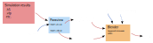

This repository contains a set of tools to ease the ingestion and render of scientific data. Specifically, in includes a set of ParaView scripts to generate sequences of `.ply` and `.vdb` files and a Blender addon to read and interact with them. 
Each tool and script is designed to be easily used on a headless system like a HPC.


# Workflow




Simulation results need to be converted and processed in formats that Blender can read. `export_ply.py` and `export_vdb.py` can be used to extract surface and volumes respectively. Because Blender doesn't handle sequence of `ply` files, `SequenceDataLoader` addon was written for that purpose. Beside managing file sequences, it also eases headless rendering by using a `.yaml` configuration file to overwrite information stored in the `.blend` file, like the resolution percentage or the number of ray traced samples.


# Blender addon

This addon handles loading sequences of `.ply` files as well as providing some quality of life features when rendering `.blend` files headlessly and in parallel.

## Installation

This addon (optionally) requires pyyaml when using yaml configuration files. It can be installed inside Blender via pip. Alternatively, the `setup_blender.py` script handles it as well as installing the `SequenceDataLoader` Blender addon.


### Headless

After cloning this repository, the addon can be installed headlessly by running:
```
zip -r SequenceDataLoader.zip SequenceDataLoader/
blender -b --python setup_blender.py -- SequenceDataLoader.zip
```

### GUI

pyyaml can be installed by running the following command inside Blender's python terminal:
```Python
import pip
pip.main(['install', 'pyyaml', '--user'])
```
Finally, like any addon, `SequenceDataLoader` can be installed by going in Edit>Preferences>Add-ons>Install and selecting the .zip file associated with the release.


## Usage

### Available features

The addon's settings are gathered in a single panel in the 3D viewport. In it, several sections can be seen:

- Configuration: all the settings available in this addon are saved in the `.blend` file. However, for ease of use in a headless setup, they can also be exported to a .yaml file and edited using just a text editor. This section handles reading and writing this yaml config file.

- Timing: because the time step of the sequence and Blender's frames may not line up, this section sets this up. `Start Time` and `End Time` relate to the sequence files when `Start Frame` and `End Frame` are Blender's start and end frames. `Interpolate time` allows to map the sequence time to Blender's start and end frames, if disabled a one-to-one map is done with `Start Time -> Start Frame`.

- Objects: multiple sequences can be added at once, each of them are associated with an `Object`, clicking `Add Object` will create a new sequence. The `Name` should be an `Object`, `Path` is the path to the sequence. In this `Path`, the location of the time index should be replaced by `###` for the addon to properly detect the sequence. If `#` aren't present, it will try to autodetect the sequence numbering location.

- Update data: because the import can potentially be slow, sequence data can either be loaded on demand by clicking `Load Current Frame`, or be updated at every frame change by toggling `Live update`.

- Render settings: This section mainly shows some convenient Blender parameters for easier tweaking in the .yaml configuration for headless rendering.


### Headless renders

To render frames 1 to 17 from `file.blend` the following line can be run:

```Bash
blender -b file.blend --python-expr "import bpy; bpy.context.scene.sequence_data_render.render_frames()" -- --config-file config.yaml --render-path blender_export --frames 1-17
```

- Note that it will only render a frame if the image file isn't already present in the export folder. This allows to run multiple Blender instances simultaneously to speed up the renders.
- The yaml configuration file is optional, any value present in it will overwrite what was saved in the `.blend` file.


# ParaView scripts

### `export_ply.py`

usage:
```Bash
pvpython export_ply.py --data-path path/with/input/data --export-path ply_export statefile.pvsm
```

This script will will load the statefile and, for every single timestep, export the visible filters to separate `.ply` files in the folder specified by `--export-path`.


### `export_vdb.py`

usage:
```Bash
pvpython export_vdb.py --data-path path/with/input/data --export-path vdb_export --sampling-bounds="0,1,-0.5,0.5,-2,2" --cell-size 0.01
```

This script generates `.vdb` files from input data given in `--data-path`. It uses the `ResampleToImage` filter that optionally requires the bounds of the domain to be exported as well as either the cell size (`--cell-size`) or the number of cells in x,y and z (via `--sampling-dims`).


